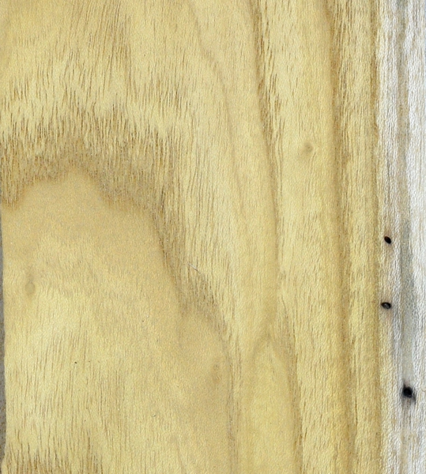

rstBasics
=========

.. contents::

These are some things that have happened in this project.

A subsection
------------

This is something in the subsection

A sub-subsection
''''''''''''''''

This is something in the sub-subsection

Another section
===============

This is something in another section.

To create a hyperlink, wrap it all in back ticks followed by an underscore. The
name of the link appears first, followed by the url wrapped in angle brackets.
For example, here is a link `sphinx docs
<https://www.sphinx-doc.org/en/master/usage/quickstart.html>`_

If you will be referencing the same link, you can label it with a bookmark and
only define the link once.  This a link to the python docs created using a
reference to a directive like this:  `Python Docs`_.  The first character of the
directive name must be an underscore, and the the two back ticks wrapping the
reference must be followed immediately by an underscore.  Often all of the
references to urls is placed at the end of the document.

Comments
--------

comments can be added by prefixing the line with two dots.  THere is  comment
right after this sentence, but you can't see it.

.. this is a comment (that will not be rendered)

Bold is indicated by two **stars**

Italics is indicated by one *star*

For inline code blocks, you need **two** backtick (``print(hello)``).  only one
back tick is required in markdown.

Code Blocks
-----------

Two colons, an empty line, and then indent your code two spaces:

::

   print('hello world!')

The double colons can also be placed at the end of a line::

   print('hello world!')

If you want to specify a specific language for your code block, use two periods
(rather than colons) and used the code argument:

.. code:: python

  from datetime import datetime
  print(datetime.now())
  print('This is python code')

.. code:: R

  cat('This is R code')

.. code:: javascript

  console.log('This is javascript')

The code will be highlighted appropriately by pygments.

Lists
-----

Lists are created exactly the same as in markdown although you can use stars as well as +'s:

+ apples
+ oranges
+ pears

Longer list items just need to be indented:

+ Dolore ea incididunt amet enim irure veniam sunt duis ut excepteur. Cupidatat
  culpa Lorem sunt velit commodo in ex nisi enim ea dolore dolore aute. Irure
+ culpa eiusmod consectetur consequat duis eiusmod quis eiusmod. Incididunt dolor
  deserunt in et.

We can do numbered list too:

1. apples
2. oranges
3. pears

The pound sign can be used in place of numbers to dynamically create numbered
lists rather than hard coding each element:

#. apples
#. oranges
#. pears

Notes
-----

It is possible  put content in notes to ensure that it is highlighted:

.. note::

  This is some text in a note.

.. attention::

  This is some text using the **attention** declarative.

.. danger::

  This is some text using the **danger** declarative.

.. _tables:

Tables
======

There are multiple ways to define tables (unlike markdown)

This is the simple table:

========  ========  ========
Column A  Column B  Column C
========  ========  ========
row1A     row1C     row1C
row2A     row2C     row2C
row3A     row3C     row3C
row4A     row4C     row4C
========  ========  ========

The other is the grid table - which looks very similar to tables in orgmode.
THis style is preferred if your table is more complicated.

+----------+----------+----------+
| Column A | Column B | Column C |
+==========+==========+==========+
| row1A    | row1C    | row1C    |
+----------+----------+----------+
| row2A    | row2C    | row2C    |
+----------+----------+----------+
| row3A    | row3C    | row3C    |
+----------+----------+----------+
| row4A    | row4C    | row4C    |
+----------+----------+----------+

There is also a csv table format using a cvs-table directive. It is probably the
easiest way to create a simple table:

.. csv-table::
  :header: "Column A",  "Column B",  "Column C"

  "row1A","row1C","row1C"
  "row2A","row2C","row2C"
  "row3A","row3C","row3C"
  "row4A","row4C","row4C"

Page Table of Contents
======================

A table of contents can be created for each individual document by adding
``..contents:: `` immediately below the main title for the page.

.. _images:

Images
======

Images can be inserted using syntax that is very similar to markdown:

``.. image:: ./images/Ailanthus_raw.jpg``

It accepts either paths (absolute or relative) or urls.

